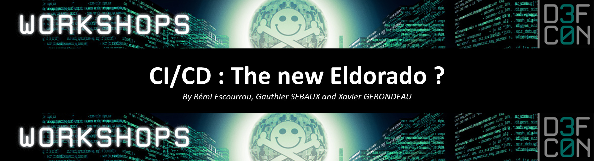
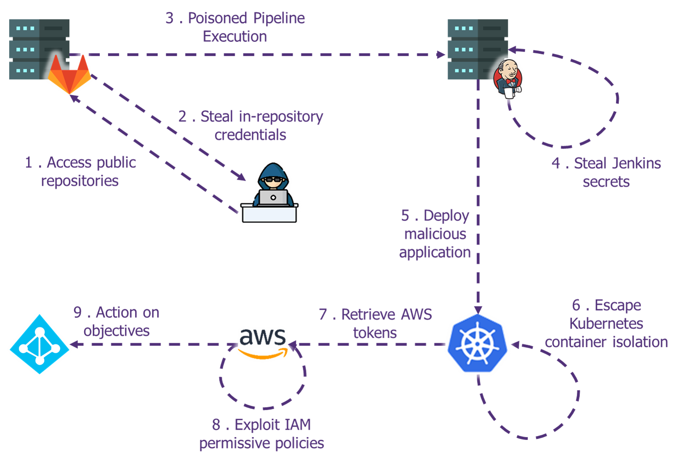

[](#)

# CI/CD : The new Eldorado ?

## Abstract

CI/CD pipelines are increasingly becoming part of the standard infrastructure within dev teams, with the rise of new approaches such as Infrastructure as Code, the sensitivity level of such pipelines is escalating quickly. In case of compromise, it is not just the applications that are at risk anymore but the underlying systems themselves and quite often the whole information system. 

We feel that those infrastructure, while not targeted by attackers for now, will become a prime focus point for attackers in the years to come. Both because of the credentials handled by the pipelines and the usual lack of monitoring on those environments. 

During the Hacking Summer Camp 2022, we explained how attackers are beginning to exploit those weaknesses both for supply chains attacks but also to escalate their privileges within the victim IS. This repository contains the materials for the BSides Las Vegas 22 and DEFCON 30 workshops. It will allow students to exploit these attacks on a full-scale lab. 

**Presented at**
- Talk at BSides Las Vegas 22: [Abstract](https://bsideslv.org/talks#1268374) - [Slides](BSidesLasVegas22-CICD_pipelines.pdf) - [Video](https://www.youtube.com/watch?v=a3SeASgtINY)
- Workshop at BSides Las Vegas 22: [Abstract](https://bsideslv.org/talks#1268376)
- Workshop at DEFCON 30: [Abstract](https://forum.defcon.org/node/241798) - [Slides](DEFCON30-CICD_pipelines_The_new_Eldorado_workshop.pdf)

## Detailed content

Welcome to DataLeek company, after several decades of V-cycle development we have now decided to adopt the "agile" methodology. To do so, our IT teams have set up a CI/CD pipeline that rely on the most advanced and state-of-the-art tools available on the market. However, for some reasons, our CISO seems to doubt the security level of this brand new infrastructure and insist to perform a pentest on it.

Your mission, should you choose to accept it, is to evaluate the security level of this CI/CD pipeline and offer solutions to fix the issues identified.

In this fully hands-on workshop, we’ll guide you through multiple vulnerabilities that we witnessed during numerous penetration tests. You’ll learn how to:

- Get a foothold within a CI/CD pipeline
- Find interesting secrets and other information within code repositories
- How to pivot and exploit weak configuration on the orchestrator
- Compromise building nodes in order to add backdoors to artifacts
- Pivot on cloud infrastructure
- Escape kubernetes thanks to common misconfiguration
- Perform a privilege escalation in AWS

[](#)

Hand-on exercises will be performed on our lab environment with a wide variety of tools. For each attack, we will also focus on prevention, mitigation techniques and potential ways to detect exploitations.

## Getting Started

### Prerequisites

3 AWS Accounts are needed to deploy the lab:
- **[infra]** contains the virtual machines
- **[src ]** is used for the AWS privilege escalation
- **[dest]** is the target of the AWS lateral movement

### Installation

Step 1. Clone the repo

```sh
git clone https://github.com/wavestone-cdt/DEFCON-CICD-pipelines-workshop
```

Step 2. Set the AWS Secets in your credentials file

```sh
[infra]
aws_access_key_id=AKIAXXXXXXXX
aws_secret_access_key=XXXXXXXXX

[src]
aws_access_key_id=AKIAXXXXXXXX
aws_secret_access_key=XXXXXXXXX

[dest]
aws_access_key_id=AKIAXXXXXXXX
aws_secret_access_key=XXXXXXXXX
```

Step 3. From the **0_Terraform-init** folder, run:

```sh
terraform init
terraform apply --auto-approve
```

Step 4. Follow the instructions in **1_Labs**

# Previous work and reference

- N. Mittaml - [Continuous Intrusion : Why CI tools are an attacker's best friends](https://www.blackhat.com/docs/eu-15/materials/eu-15-Mittal-Continuous-Intrusion-Why-CI-Tools-Are-An-Attackers-Best-Friend.pdf)
- **RhinoSecurityLabs** - [Intro: AWS Privilege Escalation Vulnerabilities](https://rhinosecuritylabs.com/aws/aws-privilege-escalation-methods-mitigation)
- **NCC** - [10 real-world stories of how we’ve compromised CI/CD pipelines](https://research.nccgroup.com/2022/01/13/10-real-world-stories-of-how-weve-compromised-ci-cd-pipelines/)
- **Daniel Krivelevich & Omer Gil** - [Top 10 CICD security risks](https://github.com/cider-security-research/top-10-cicd-security-risks)
- **Nick Frichette (@Frichette_n)** - [Hacking the cloud](https://hackingthe.cloud/)
- **BishopFox** - [Bad Pods: Kubernetes Pod Privilege Escalation](https://bishopfox.com/blog/kubernetes-pod-privilege-escalation)
- **CyberArk** - [Securing Kubernetes Clusters by Eliminating Risky Permissions](https://www.cyberark.com/resources/threat-research-blog/securing-kubernetes-clusters-by-eliminating-risky-permissions)

# Acknowledgment

This workshop was originally created by [Rémi ESCOURROU](https://twitter.com/remiescourrou), [Gauthier SEBAUX](https://twitter.com/zeronounours) and [Xavier GERONDEAU](https://twitter.com/reivaxxavier1) as part of our work at @Wavestone in the Offensive Security Team.

A huge thank you to our friend and AWS master, Arnaud PETITCOL, for his help and advice.

# License
 
This project is licensed under the MIT License - see the [LICENSE.md](LICENSE.md) file for details.
